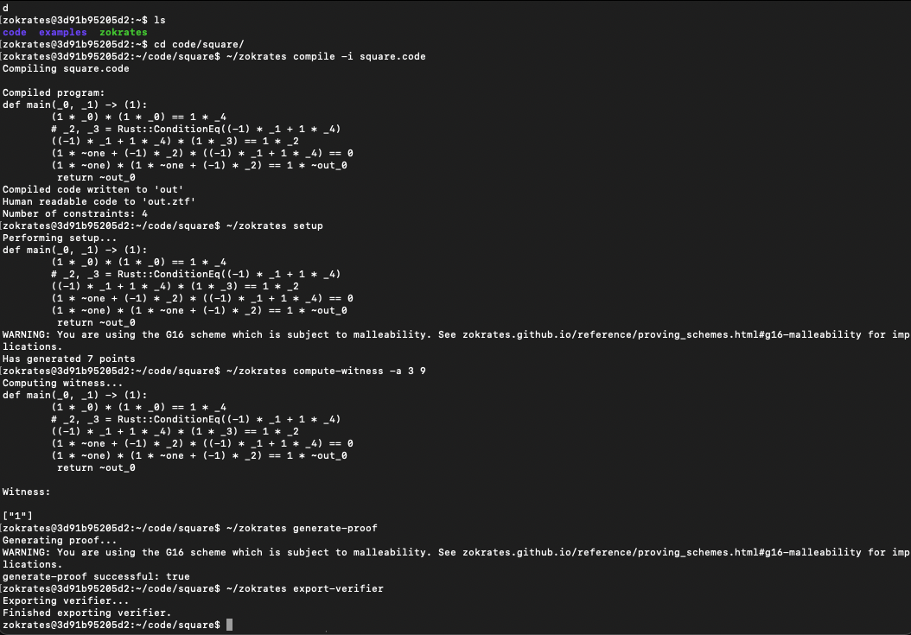
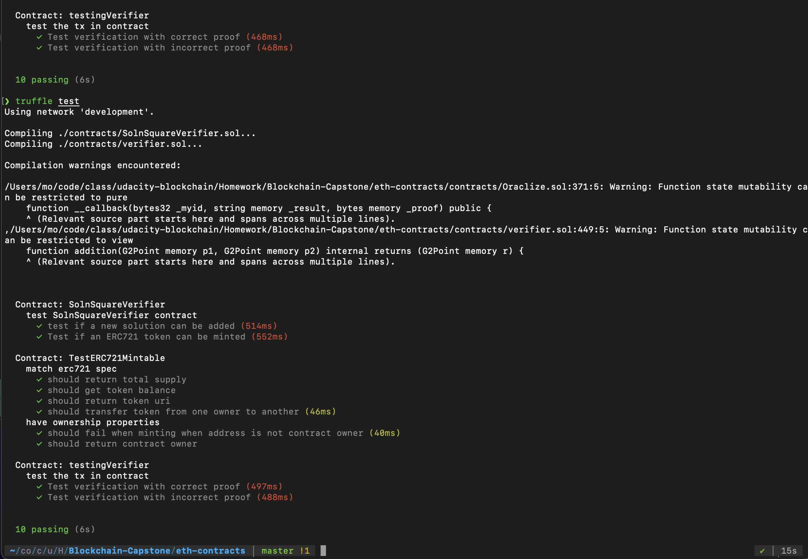

# Udacity Blockchain Capstone

The capstone will build upon the knowledge you have gained in the course in order to build a decentralized housing product. 

# Version requirement
```
node 15.14.0
truffle 5.0.2
solidity 0.5.1
```

# Dev Instruction 

##### Install dependencies
```
npm install
```

##### Compile contract
```
cd eth-contracts
truffle compile
```

##### Run blockchain simulation by this account for testing
```bash
ganache-cli -a 20 -l 9999999 -m "slice congress throw plastic rely coyote margin myself together manage romance actress"
```

##### Run ZoKrates

Ref here
* (https://andresaaap.medium.com/creating-simple-zero-knowledge-verifier-contract-with-zokrates-0-5-0-solidity-0-5-0-13e9d615fe80)
* (https://andresaaap.medium.com/creating-simple-zero-knowledge-verifier-contract-with-zokrates-0-7-13-solidity-0-8-0-666518e1f411)
* (https://noha-abuaesh.medium.com/zk-snarks-how-can-knowing-some-numbers-prove-the-truth-about-anything-in-real-life-bd4cce15710f)
* (https://www.altoros.com/blog/zero-knowledge-proof-improving-privacy-for-a-blockchain/)

```
docker run -v /Users/mo/code/class/udacity-blockchain/Homework/Blockchain-Capstone/zokrates/code:/home/zokrates/code -ti zokrates/zokrates:0.5.0 /bin/bash
```

```
cd code/square/
~/zokrates compile -i square.code
~/zokrates setup
~/zokrates compute-witness -a 3 9
~/zokrates generate-proof
~/zokrates export-verifier
```



##### Test
```
truffle test
```



# Deploy Instruction

###### .env
* edit variable in .env.temp to .env
```
INFURA_KEY=<your-infura-key>
SECRET=<your-metamask-12-words-seed>
OWNER_ADDRESS=<your-metamask-account>
CONTRACT_ADDRESS=<your-deployed-SolnSquareVerifier-contract-address>
```

###### Deploy to rinkeby
```
cd eth-contracts
truffle compile
truffle deploy --network rinkeby
```

# Project Resources

* [Remix - Solidity IDE](https://remix.ethereum.org/)
* [Visual Studio Code](https://code.visualstudio.com/)
* [Truffle Framework](https://truffleframework.com/)
* [Ganache - One Click Blockchain](https://truffleframework.com/ganache)
* [Open Zeppelin ](https://openzeppelin.org/)
* [Interactive zero knowledge 3-colorability demonstration](http://web.mit.edu/~ezyang/Public/graph/svg.html)
* [Docker](https://docs.docker.com/install/)
* [ZoKrates](https://github.com/Zokrates/ZoKrates)
