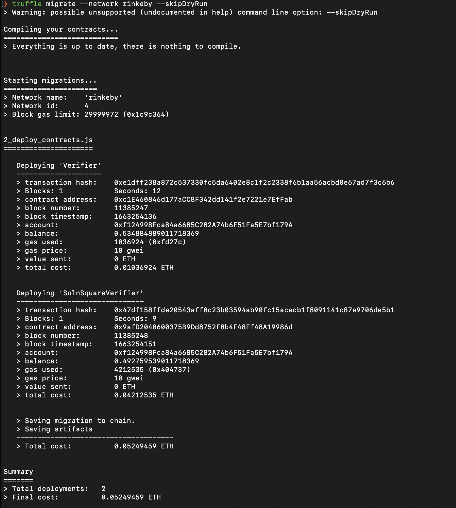

# Udacity Blockchain Capstone

The capstone will build upon the knowledge you have gained in the course in order to build a decentralized housing product. 

# Version requirement
```
Truffle v5.3.6 (core: 5.3.6)
Solidity - 0.5.2 (solc-js)
Node v15.14.0
Web3.js v1.3.5
```

# Dev Instruction 

##### Install dependencies
```
npm install
```

##### Compile contract
```
cd eth-contracts
truffle compile
```

##### Run blockchain simulation by this account for testing
```bash
ganache-cli -a 20 -l 9999999 -m "slice congress throw plastic rely coyote margin myself together manage romance actress"
```

##### Run ZoKrates

Ref here
* (https://andresaaap.medium.com/creating-simple-zero-knowledge-verifier-contract-with-zokrates-0-5-0-solidity-0-5-0-13e9d615fe80)
* (https://andresaaap.medium.com/creating-simple-zero-knowledge-verifier-contract-with-zokrates-0-7-13-solidity-0-8-0-666518e1f411)
* (https://noha-abuaesh.medium.com/zk-snarks-how-can-knowing-some-numbers-prove-the-truth-about-anything-in-real-life-bd4cce15710f)
* (https://www.altoros.com/blog/zero-knowledge-proof-improving-privacy-for-a-blockchain/)

```
docker run -v /Users/mo/code/class/udacity-blockchain/Homework/Blockchain-Capstone/zokrates/code:/home/zokrates/code -ti zokrates/zokrates:0.5.0 /bin/bash
```

```
cd code/square/
~/zokrates compile -i square.code
~/zokrates setup
~/zokrates compute-witness -a 3 9
~/zokrates generate-proof
~/zokrates export-verifier
```


##### Test
```
truffle test
```


# Deploy Instruction

###### .env
* edit variable in .env.temp to .env
```
INFURA_KEY=<your-infura-key>
SECRET=<your-metamask-12-words-seed>
OWNER_ADDRESS=<your-metamask-account>
CONTRACT_ADDRESS=<your-deployed-SolnSquareVerifier-contract-address>
```

###### Deploy to rinkeby
```
cd eth-contracts
truffle compile
truffle deploy --network rinkeby
// truffle migrate --network rinkeby --skipDryRun
```

Result of deploy contract
```bash
❯ truffle migrate --network rinkeby --skipDryRun
> Warning: possible unsupported (undocumented in help) command line option: --skipDryRun

Compiling your contracts...
===========================
> Everything is up to date, there is nothing to compile.


Starting migrations...
======================
> Network name:    'rinkeby'
> Network id:      4
> Block gas limit: 29999972 (0x1c9c364)


2_deploy_contracts.js
=====================

   Deploying 'Verifier'
   --------------------
   > transaction hash:    0xe1dff238a872c537330fc5da6402e8c1f2c2338f6b1aa56acbd0e67ad7f3c6b6
   > Blocks: 1            Seconds: 12
   > contract address:    0xc1E460846d177aCC8F342dd141f2e7221e7EfFab
   > block number:        11385247
   > block timestamp:     1663254136
   > account:             0xf124998Fca84a6685C282A74b6F51Fa5E7bf179A
   > balance:             0.534884889011718369
   > gas used:            1036924 (0xfd27c)
   > gas price:           10 gwei
   > value sent:          0 ETH
   > total cost:          0.01036924 ETH


   Deploying 'SolnSquareVerifier'
   ------------------------------
   > transaction hash:    0x47df158ffde20543aff0c23b03594ab90fc15acacb1f8091141c87e9706de5b1
   > Blocks: 1            Seconds: 9
   > contract address:    0x9afD2040600375B9Dd8752F8b4F48Ff48A19986d
   > block number:        11385248
   > block timestamp:     1663254151
   > account:             0xf124998Fca84a6685C282A74b6F51Fa5E7bf179A
   > balance:             0.492759539011718369
   > gas used:            4212535 (0x404737)
   > gas price:           10 gwei
   > value sent:          0 ETH
   > total cost:          0.04212535 ETH


   > Saving migration to chain.
   > Saving artifacts
   -------------------------------------
   > Total cost:          0.05249459 ETH


Summary
=======
> Total deployments:   2
> Final cost:          0.05249459 ETH
```


| Contract | Address |
|---|---|
|  *Verifier* | [0xB3a8420892EF98E6815A512584628c5453577738](https://rinkeby.etherscan.io/address/0xc1E460846d177aCC8F342dd141f2e7221e7EfFab) |
|  *SolnSquareVerifier* | [0x9afD2040600375B9Dd8752F8b4F48Ff48A19986d](https://rinkeby.etherscan.io/address/0x9afD2040600375B9Dd8752F8b4F48Ff48A19986d) |

# Project Resources

* [Remix - Solidity IDE](https://remix.ethereum.org/)
* [Visual Studio Code](https://code.visualstudio.com/)
* [Truffle Framework](https://truffleframework.com/)
* [Ganache - One Click Blockchain](https://truffleframework.com/ganache)
* [Open Zeppelin ](https://openzeppelin.org/)
* [Interactive zero knowledge 3-colorability demonstration](http://web.mit.edu/~ezyang/Public/graph/svg.html)
* [Docker](https://docs.docker.com/install/)
* [ZoKrates](https://github.com/Zokrates/ZoKrates)
